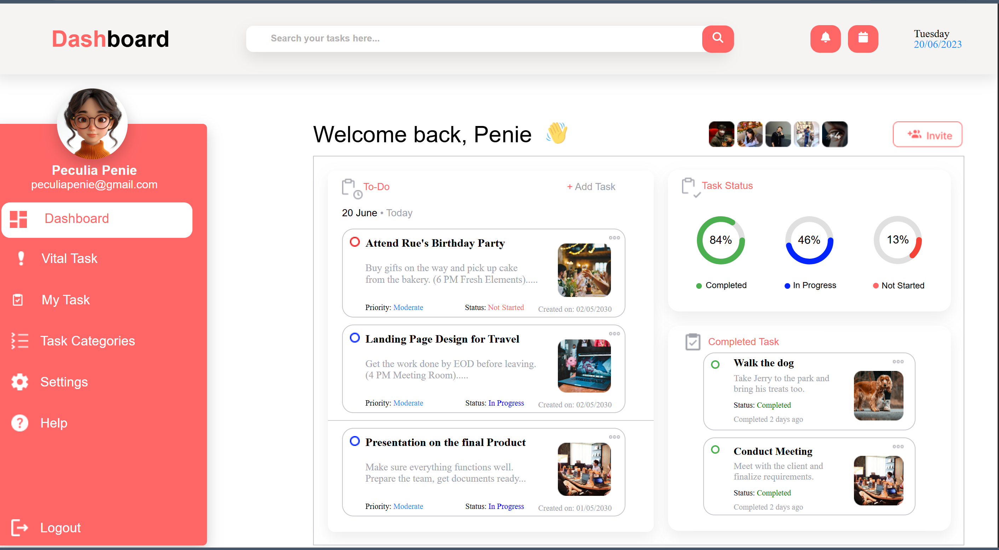
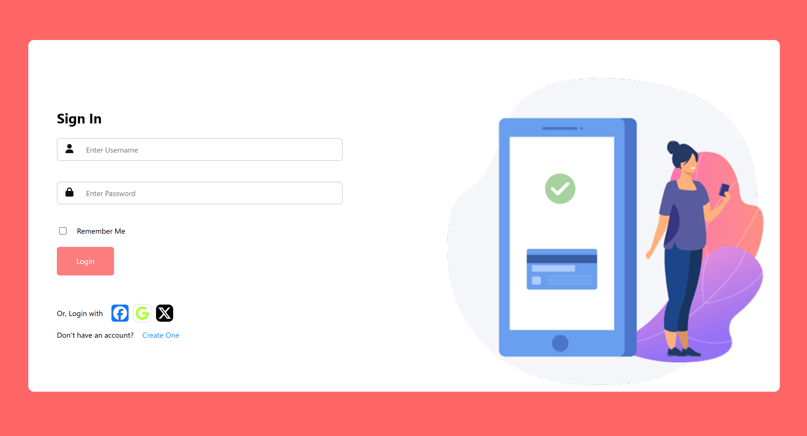
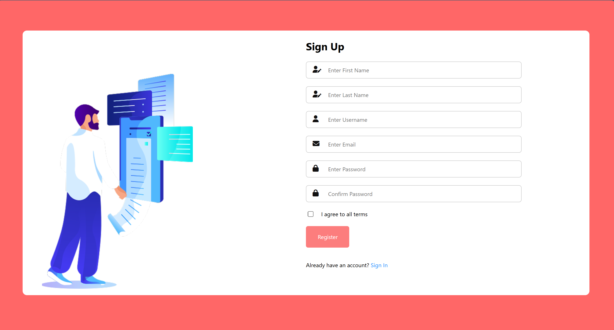

# debbs-todo-app
A front‑end to‑do list application built with HTML, CSS, and JavaScript.

## 📌 Overview
This project is a simple and clean to‑do list web application featuring:
- Sign In page  
- Sign Up page  
- Dashboard  
- Logout functionality  
- Basic navigation flow  

It is designed as a beginner‑friendly front‑end project that will later be expanded with real functionality such as:
- Task creation  
- Task deletion  
- Saving tasks  
- User authentication  
- Local storage or database integration  

## 🚀 Features (Current)
- Fully working navigation between pages  
- Login → Dashboard  
- Logout → Sign In  
- Register → Sign In  
- Clean and simple UI  
- Organized project structure  

## 🎯 Planned Features (Future)
- Add tasks to the dashboard  
- Mark tasks as complete  
- Delete tasks  
- Save tasks using LocalStorage  
- Add animations and improved UI  
- Connect to a backend (Node.js or Python)  
- Deploy the project online  

## 📁 Project Structure
To do list/
│── index.html
│── signin.html
│── signup.html
│── todo.css
└── images/

## 🛠️ Technologies Used
- **HTML5**
- **CSS3**
- **JavaScript**
- (Future: React, Node.js, Firebase, or SQL)

## 📸 Screenshots
### Dashboard

### Sign In Page

### Sign Up Page

## 💡 Motivation
This project is part of my learning journey in web development and will grow as I improve my skills in:
- Front‑end development  
- JavaScript  
- UI/UX  
- Git & GitHub  
- React (future)  

## 📬 Contact
If you want to connect or collaborate, feel free to reach out!

